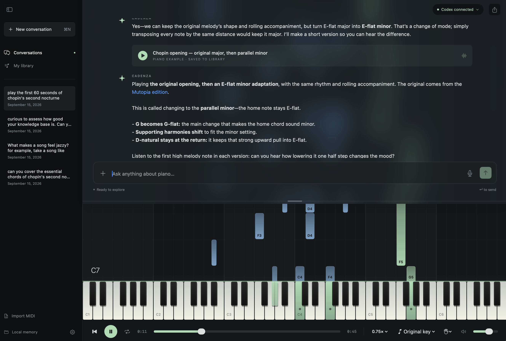

# Cadenza

A native macOS piano tutor. Ask about harmony, hear the agent demonstrate it, and keep exploring. SwiftUI, AVAudioEngine, standard MIDI files, and a persistent local Codex app-server conversation. No third-party packages or API key required.



## Run

Requires macOS 14+, Swift 6 (Xcode or Command Line Tools), and a current Codex CLI. Tested against Codex CLI 0.154.0. Dynamic piano tools use the experimental app-server interface, so CLI upgrades may require adapter changes.

```sh
codex login                    # Sign in with ChatGPT
bash scripts/build-app.sh      # Builds dist/Cadenza.app
open dist/Cadenza.app
```

Use the `.app` bundle for microphone permissions. `swift run Cadenza` also works for typed questions and playback. Open `Package.swift` in Xcode for development. The app discovers common CLI installations (including nvm); set an absolute path in Settings if discovery fails.

```sh
bash scripts/test.sh           # Selects Xcode for XCTest if needed
```

## What works

- Falling notes aligned with an interactive piano keyboard; fit-to-notes or full 88-key range.
- Full-height piano behind a top chat overlay with live backdrop blur. Drag the overlay's lower boundary to resize it; the height is remembered and the keyboard stays fixed.
- Piano sound from the built-in macOS General MIDI sound bank.
- Play, pause, seek, loop, speed adjustment, transpose, hand isolation, volume, MIDI export.
- Real streamed Codex conversations with persistent thread resume and model discovery.
- Agent tools to compose/play examples, replay passages, inspect MIDI, save Markdown memories, and recall them.
- Live Codex web search with linked references, public page/link extraction, and validated MIDI downloads with saved source credits.
- Example replay cards, searchable music library, session history, and Markdown conversation exports.
- MIDI format 0/1 import with PPQ timing, running status, per-channel notes, tempo changes, markers, and sustain pedal handling.
- Optional on-device speech-to-text with microphone permission prompts. Dictation goes into the editable prompt; it is not automatically sent.
- Cancel, timeouts, connection recovery, validation of tool input, and app-mediated local file storage.

## Using it

Press play for the welcome progression or click any key. Ask “How do seventh chords resolve?” and the tutor can create and play an example during its answer. Each example is saved automatically. Use **My library** to recall it, and ask for a change in voicing or a different continuation.

Use **Import MIDI** (⌘O) to load a piece. It becomes the selected context for the next question. The tutor can inspect the actual note events and demonstrate a beat range. Imported hands are estimated from pitch. Time coordinates in the tools use quarter-note beats, starting at zero—not measure numbers.

You can also ask the tutor to research a piece and find a MIDI. It can search the web, read public resource pages, extract download links, and import a MIDI into the library. Downloads load without autoplay; the tutor can inspect and demonstrate a relevant passage afterward. Source links and licensing credits are retained with the original MIDI and shown in the conversation. Named-song analysis is instructed to consult references and distinguish source facts from musical inference or illustrative arrangements.

⌘N starts a new conversation; ⌘, opens settings; ⌘Space toggles playback; ⌘. stops; ⇧⌘E exports MIDI. The toolbar exposes all playback controls without shortcuts.

## Subscription integration

Cadenza launches its own `codex app-server --listen stdio://` process and reuses Codex-managed login credentials. It checks `account/read` and only enables the tutor for `type: chatgpt`. It does not read/copy tokens, ask for API keys, or silently fall back to API billing. Subscription limits and account policies still apply. The model runs in the cloud; only the app, audio rendering, MIDI, and workspace are local.

This is a dedicated tutor thread, **not** an attachment to whichever CLI or desktop conversation happens to be open. Threads resume through app-server IDs. The provider protocol and piano tool contract are separated from transport so a Claude adapter can be added later; Claude is not implemented in v1.

Existing conversations upgrade their backing Codex thread on the next question when new custom tools are added (the tested CLI fixes those tools at thread creation). Visible history, examples, and memories stay intact; the prior thread ID is retained. The latest 80,000 characters of visible history are carried forward, and a transcript tool can retrieve earlier messages. Hidden reasoning and old tool-call internals are not transferred.

Official references: [App server](https://learn.chatgpt.com/docs/app-server), [Authentication](https://learn.chatgpt.com/docs/auth), [Web search](https://learn.chatgpt.com/docs/web-search).

## Local workspace and privacy

Default location:

```text
~/Library/Application Support/Cadenza/Workspace/
  Examples/          <uuid>.json + <uuid>.mid
  Memories/          <uuid>.md
  Conversations/     <uuid>.json + <uuid>.md
  Imports/           original imported MIDI bytes + downloaded-source Markdown
  README.md
```

Open the workspace from the sidebar or Settings. Memories can be edited with any text editor and are read again on the next question. The agent chooses which useful observations to remember. Examples are always saved; memory Markdown can reference their stable IDs. Conversations also persist in Codex's own session store.

Selected-piece metadata, library metadata, memory excerpts, and inspected note events are sent to Codex as conversation context. Importing by itself does not start a model turn. On-device speech recognition is required; if the language/device does not support it, use typed input or macOS Dictation.

Web search runs through Codex with `web_search="live"`. Search queries go to the search service; resource URLs are fetched directly by the Mac using public HTTP(S) GET requests without stored cookies or credentials. Downloads have size/time/redirect limits and reject local/private network destinations. Page content is treated as untrusted data, not tool instructions. The tutor is instructed not to disclose private conversation or memory contents to resource sites.

The Codex subprocess has shell/app/plugin/multi-agent features disabled, inherited MCP servers disabled for its tutor threads, read-only sandboxing, and no approval escalation. Music and memory writes happen through validated app tools. The legacy read-only sandbox is not a restriction on all filesystem reads; the tutor's narrow tool set is the primary access boundary. Cadenza itself is a locally signed, unsandboxed Mac app because it launches a CLI; it is not a Mac App Store sandbox distribution.

## Scope and known limitations

- This is a working initial version, not a notarized distribution. The build script signs locally; distributing to other Macs requires a Developer ID and notarization. macOS may ask again for microphone permission after rebuilding an ad-hoc-signed app.
- A language model can produce incorrect harmony or uncomfortable voicings. Web references and downloaded MIDI improve grounding but do not guarantee accuracy; arrangements can differ from original scores. MIDI lacks enharmonic spelling and much notation context.
- Page extraction supports public HTML/text, including ordinary MIDI download links and embedded audio URLs. It does not execute JavaScript, extract ZIP files, or bypass login, paywalls, CAPTCHAs, or anti-bot restrictions. The tutor should find another authorized source when blocked. Availability and licensing vary by resource.
- MIDI formats 0/1 with PPQ timing are supported. Format 2 and SMPTE are explicitly rejected. Imports are limited to 20 MB and 100,000 notes. All channels use piano; instrument programs, pitch bend, time signatures, non-sustain controllers, and original track organization are not reproduced. Sustain becomes extended note lengths on export.
- Full 128 MIDI pitches are retained; the 88-key view can hide notes outside a physical piano's range. Fit view includes them. Transposition drops notes outside MIDI's 0–127 range on export. Displayed chord labels retain their original spelling when transposed.
- Playback uses a monotonic clock and a 120 Hz main-run-loop scheduler. It is suitable for listening and demonstrations, not sample-accurate performance recording. A long run-loop stall pauses playback to prevent bursts or stuck notes. Imported passages with dense sustained notes may be demanding.
- Speech input is optional; spoken tutor answers, notation rendering, hardware MIDI input, assessment of playing, and Claude are outside v1.
- A missing/deleted Codex thread does not silently lose or replace the conversation; the error is shown. Start a new conversation if its server-side thread can no longer be resumed.

## Structure

`PianoCore` contains validated score models, MIDI parsing/writing, and persistence. `Cadenza` contains the SwiftUI studio, AVAudioEngine player, speech input, app model, tool dispatch, and JSON-RPC Codex adapter. No web view or web service is involved in the UI.

## Integration checks

The following opt-in checks use temporary workspaces, then quit. Close the ordinary app first. Playback tests do not contact Codex; the tutor and research checks each use two real subscription turns. Research also fetches a public Mutopia page and MIDI.

```sh
open -n dist/Cadenza.app --args --playback-test
# Report: /tmp/cadenza-playback-result.json
open -n dist/Cadenza.app --args --integration-test
# Report: /tmp/cadenza-integration-result.json
open -n dist/Cadenza.app --args --research-test
# Report: /tmp/cadenza-research-result.json
```

The playback check measures nonzero PCM audio from the mixer, verifies advancing playback, highlighted notes, pause/stop, seek, transposition, hand isolation, looping, and app-level MIDI import. The tutor check verifies tool-generated MIDI, Markdown memory, reconnect, and resuming the same conversation. The research check verifies live web search, page extraction, MIDI import with provenance, legacy-thread upgrade, and subsequent resume. These checks do not exercise microphone transcription; test that interactively on the target Mac and language.
