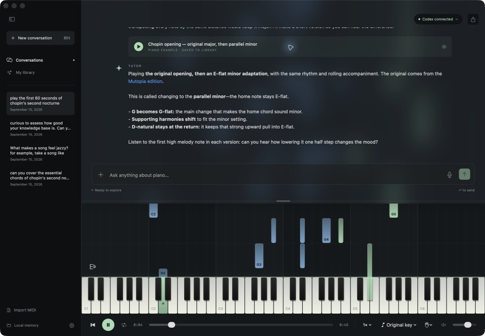

# Piano

A native macOS piano tutor powered by Codex. Ask about music, hear examples, and explore songs through a falling-note piano renderer.



- Agent-controlled playback, chord demonstrations, and MIDI analysis.
- Web research and MIDI downloads with source references.
- Resizable, blurred chat overlay and optional voice input.
- Local Markdown memories, saved conversations, and MIDI examples.

## Setup

**Easiest: open this repo in your own Codex agent and ask it to get everything running on your Mac.**

> Set up this app using my local Codex CLI and ChatGPT subscription. Check dependencies, make any necessary configuration changes, then build, launch, and verify the connection.

Requires macOS 14+, Swift 6, and Codex CLI. Tested with CLI 0.154.0.

```sh
codex login                  # Sign in with ChatGPT
bash scripts/build-app.sh
open dist/Piano.app
```

If Codex isn't found, set its executable path in Settings (⌘,). The app uses your local Codex login and a dedicated tutor conversation; no API key required. The model runs in the cloud, and subscription limits apply.

## Use

Ask “How do seventh chords resolve?” or “Find Chopin's second nocturne and explain its opening.” The tutor can research, play examples, and revisit saved passages.

Import MIDI with ⌘O, replay examples from the library, and drag the chat divider to resize it. Playback supports looping, speed changes, transposition, and hand isolation.

Memories and music live in `~/Library/Application Support/Piano/Workspace/` (older installations retain their existing location). Open the folder from the sidebar to edit memories directly.

## Development

SwiftUI + AVAudioEngine, no third-party packages. Open `Package.swift` in Xcode; `PianoCore` handles MIDI and persistence, and `Piano` contains the app and Codex adapter.

```sh
bash scripts/test.sh
```

Optional app flags: `--playback-test`, `--integration-test`, `--research-test`. Close the normal app first; checks use temporary workspaces and write `/tmp/piano-*-result.json`. The latter two use real subscription turns.

## Limitations

- Experimental Codex app-server integration; CLI updates may require changes.
- MIDI format 0/1 with PPQ timing, up to 20 MB. All instruments play as piano.
- Musical analysis can be wrong; MIDI isn't a substitute for a score.
- No hardware MIDI input or Claude support yet. Builds are locally signed, not notarized.
